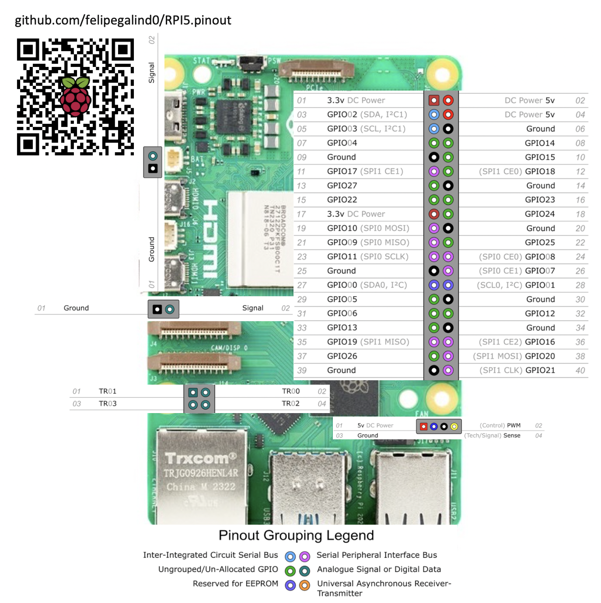

# LME_DETECTOR_IMX296LQR-C

## ตัวอย่างการใช้งาน
- [ชมวิดีโอตัวอย่าง](https://youtu.be/TP1eUsSMoBs?si=pW1v3e3p2M26bULp)

---

## 🚀 วิธีการรีโมทผ่าน SSH
```bash
# ลบ ssh-key เดิม (กรณีมีปัญหา key ซ้ำ)
ssh-keygen -R 192.168.10.7

# เชื่อมต่อ SSH
ssh polipharm@192.168.10.7

# ส่งไฟล์ไปยังเครื่องปลายทาง
scp main.py polipharm@192.168.10.7:/home/polipharm/Desktop
```
> 💡 **Tip:** เปลี่ยน IP และชื่อไฟล์ตามที่ต้องการ

---

## 🛠️ การ Build และ Deploy Qt for Python (PySide6)
```bash
# แปลงไฟล์ .ui เป็น .py
pyside6-uic gui/DETECTOR_7inch.ui > src/ui_DETECTOR_7inch.py
pyside6-uic gui/DETECTOR_10inch.ui > src/ui_DETECTOR_10inch.py

# สร้าง resource_rc.py จาก resource.qrc
pyside6-rcc gui/resource.qrc -o resource_rc.py

# ⚠️ ควรแปลงไฟล์ ui_DETECTOR_7inch.py ให้เป็น UTF-8 ก่อนใช้งาน
```

---

## 🏗️ การติดตั้ง Environment

### Windows
```bash
cd polipharm
python -m venv detection_venv
detection_venv\Scripts\activate
```

### Linux
```bash
cd polipharm
# หรือใช้ venv พร้อม system-site-packages
python3 -m venv --system-site-packages detection_venv
source detection_venv/bin/activate
pip3 install gpiozero
```

### ติดตั้งฟอนต์ Kanit (สำหรับ Linux)
```bash
# แตกไฟล์ .zip ฟอนต์จาก .assets/fonts/kanit.zip
cd fonts
sudo mkdir /usr/share/fonts/kanit
sudo mv *.ttf /usr/share/fonts/kanit
cd /usr/share/fonts/kanit
sudo mkfontscale
sudo mkfontdir
fc-cache
xset fp rehash
```
> 📝 **หมายเหตุ:** สำหรับ Windows ให้ติดตั้งฟอนต์โดยดับเบิลคลิกไฟล์ .ttf

## 📦 การติดตั้ง Libraries ที่จำเป็น

### ติดตั้ง PySide6
```bash
pip install PySide6-Addons # keyboard
pip install pyside6
pip install pytesseract
pip install comtypes
pip install requests
pip install pyserial
pip install numpy
pip install opencv-python
# pip install opencv-contrib-python
```

## 📦 การติดตั้ง Libraries เพิ่มเติม
```bash
pip install pywifi
pip install gpiozero
pip install ultralytics
```

## 📦 การตั้งค่า black formatter
```bash
pip install black
```
- สร้างไฟล์ `pyproject.toml` ไว้ในโปรเจค
```bash
    [tool.black]
    line-length = 200
    target-version = ['py311']
    skip-string-normalization = true
    include = '\.pyi?$'
    exclude = '''
    /(
        \.git
    | detection_venv
    | test
    | build
    | dist
    )/
    '''
```
- ตั้งค่าใน settings.json ของ VS Code
```bash
    Ctrl + Shift + P → Preferences: Open User Settings (JSON)
```
```json
    "[python]": {
        "editor.defaultFormatter": "ms-python.black-formatter"
    },
    "black-formatter.args": ["--config", "pyproject.toml"]
```

## Raspberry pi 5 pinout



---

## 📝 หมายเหตุ
- คำสั่งบางอย่างต้องใช้สิทธิ์ `sudo` (โดยเฉพาะบน Linux)
- หากพบปัญหาเกี่ยวกับฟอนต์หรือไลบรารี ให้ตรวจสอบเวอร์ชัน Python และ OS

---

> 📌 **จัดทำโดย:** ทีมงาน LME_DETECTOR  
> 🕒 อัปเดตล่าสุด: 2025-05-22

<!-- จบ README.md -->