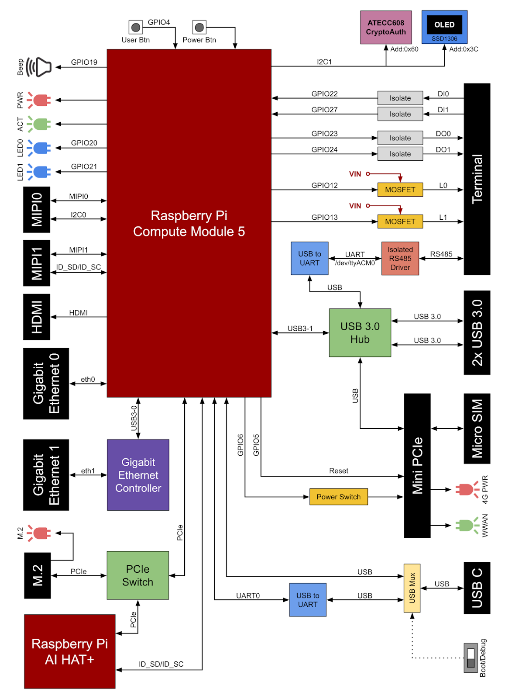

# LME_DETECTOR_IMX296LQR-C

---

## 🚀 วิธีการรีโมทผ่าน SSH
```bash
# ลบ ssh-key เดิม (กรณีมีปัญหา key ซ้ำ)
ssh-keygen -R 192.168.10.7

# เชื่อมต่อ SSH
ssh polipharm@192.168.10.7

# ส่งไฟล์ไปยังเครื่องปลายทาง
scp main.py polipharm@192.168.10.7:/home/polipharm/Desktop
```
> 💡 **Tip:** เปลี่ยน IP และชื่อไฟล์ตามที่ต้องการ

---

## 🛠️ การ Build และ Deploy Qt for Python (PySide6)
```bash
# แปลงไฟล์ .ui เป็น .py
pyside6-uic gui/DETECTOR_7inch.ui > src/ui_DETECTOR_7inch.py
pyside6-uic gui/DETECTOR_10inch.ui > src/ui_DETECTOR_10inch.py

# สร้าง resource_rc.py จาก resource.qrc
pyside6-rcc gui/resource.qrc -o src/resource_rc.py

```
> ⚠️ ควรแปลงไฟล์ ui_DETECTOR_7inch.py ให้เป็น UTF-8 ก่อนใช้งาน
---

### ⚙️ ติดตั้งฟอนต์ Kanit (สำหรับ Linux)
```bash
# แตกไฟล์ .zip ฟอนต์จาก .assets/fonts/kanit.zip
cd LME_DETECTOR_IMX296LQR-C/gui/assets/fronts
sudo mkdir /usr/share/fonts/kanit
sudo mv *.ttf /usr/share/fonts/kanit
cd /usr/share/fonts/kanit
sudo mkfontscale
sudo mkfontdir
fc-cache
xset fp rehash
```
> 📝 **หมายเหตุ:** สำหรับ Windows ให้ติดตั้งฟอนต์โดยดับเบิลคลิกไฟล์ .ttf

---

### 📷 ตั้งค่า Picamera2
- เปิดไฟล์ด้วยคำสั่ง
```bash
sudo nano /boot/firmware/config.txt
```

- เลื่อนลงไปท้ายไฟล์ แล้วเพิ่มบรรทัดนี้
```bash
dtoverlay=imx296,cam0
```

- ทดสอบกล้อง
```bash
rpicam-hello -t 0
```
## 🏗️ การติดตั้ง Environment

### 💻 Linux
```bash
cd LME_DETECTOR_IMX296LQR-C
./install.sh
```
- ทดสอบโปรแกรม
```bash
cd LME_DETECTOR_IMX296LQR-C
source detection_venv/bin/activate
python3 main.py
```

## 📦 การตั้งค่า black formatter
```bash
pip install black
```
- สร้างไฟล์ `pyproject.toml` ไว้ในโปรเจค
```bash
    [tool.black]
    line-length = 200
    target-version = ['py311']
    skip-string-normalization = true
    include = '\.pyi?$'
    exclude = '''
    /(
        \.git
    | detection_venv
    | test
    | build
    | dist
    )/
    '''
```
- ตั้งค่าใน settings.json ของ VS Code
```bash
    Ctrl + Shift + P → Preferences: Open User Settings (JSON)
```
```json
    "[python]": {
        "editor.defaultFormatter": "ms-python.black-formatter"
    },
    "black-formatter.args": ["--config", "pyproject.toml"]
```

## Raspberry pi 5 pinout


## Raspberry pi CM5 pinout



---

## 📝 หมายเหตุ
- คำสั่งบางอย่างต้องใช้สิทธิ์ `sudo` (โดยเฉพาะบน Linux)
- หากพบปัญหาเกี่ยวกับฟอนต์หรือไลบรารี ให้ตรวจสอบเวอร์ชัน Python และ OS

---

> 📌 **จัดทำโดย:** ทีมงาน LME_DETECTOR  
> 🕒 อัปเดตล่าสุด: 2025-05-22

<!-- จบ README.md -->