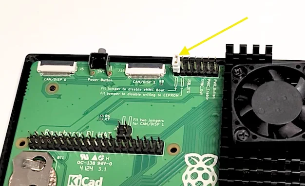

# การติดตั้งระบบปฏิบัติการ (OS) บน Raspberry Pi Compute Module 5 (CM5) ที่มี eMMC Storage (สำหรับ Windows)

> คู่มือนี้สำหรับติดตั้ง OS ลงใน eMMC ของ Raspberry Pi Compute Module 5 โดยใช้ระบบปฏิบัติการ **Windows**  
> อ้างอิงจากบทความต้นฉบับ: [Smart Home Circle](https://smarthomecircle.com/how-to-install-os-on-raspberry-pi-compute-module-5-emmc-storage)

---

## 🧰 สิ่งที่ต้องเตรียม

1. Raspberry Pi Compute Module 5 (รุ่นที่มี eMMC)
2. Raspberry Pi CM5 IO Board
3. สาย USB-C (เชื่อมระหว่าง IO Board กับ PC)
4. คอมพิวเตอร์ระบบ Windows
5. โปรแกรม **Raspberry Pi Imager**
6. โปรแกรม **RPI Boot Installer**
7. Jumper เพื่อ **ปิดการบูตจาก eMMC** (จำเป็นก่อนเริ่มแฟลช OS)

---

## ⚙️ ขั้นตอนที่ 1: ปิดการบูตจาก eMMC (Disable eMMC Boot)

ก่อนเริ่มการติดตั้ง ต้องตั้งค่าให้ CM5 เข้าโหมด “USB Boot”  
โดยการเชื่อม **jumper หรือสวิตช์** ที่ใช้ปิดการบูตจาก eMMC ตามคู่มือบอร์ด IO ของคุณ

เมื่อเปิดโหมดนี้ CM5 จะเข้าสู่ “Mass Storage Gadget Mode” ซึ่ง Windows จะมองเห็น eMMC เป็นเหมือนไดรฟ์ USB

---

## 💾 ขั้นตอนที่ 2: ติดตั้ง RPI Boot Installer

1. ดาวน์โหลด **RPI Boot Installer** จากเว็บไซต์ทางการของ Raspberry Pi  
   👉 [ดาวน์โหลดที่นี่](https://github.com/raspberrypi/usbboot)  
2. ติดตั้งโปรแกรมโดยคลิกไฟล์ `.exe`  
3. ระหว่างติดตั้งจะมีหน้าต่าง Command Prompt เปิดขึ้นหลายครั้งเพื่อรันสคริปต์ติดตั้ง driver — รอจนเสร็จสมบูรณ์

หลังจากติดตั้งเสร็จ จะมีเมนูชื่อว่า  
> **CM4/CM5 Mass Storage Gadget**  
ปรากฏใน Start Menu

---

## 🔌 ขั้นตอนที่ 3: เปิดโหมด Mass Storage Gadget

1. เปิดโปรแกรม **CM4/CM5 Mass Storage Gadget** จาก Start Menu  
2. หน้าต่าง Command Prompt จะขึ้นข้อความว่า  
   ```
   Waiting for BCM2835/6/7/2711/2712...
   ```
3. เชื่อมต่อบอร์ด CM5 IO Board เข้ากับคอมพิวเตอร์ผ่านสาย USB-C  
4. รอจนไฟ **LED สีเขียว** บนบอร์ดติดค้าง  
   - หมายความว่า eMMC ถูกแมปเป็น “Drive” แล้ว  

ตอนนี้ Windows จะมองเห็น eMMC เป็นไดรฟ์ใหม่ใน “This PC”

---

## 🧠 ขั้นตอนที่ 4: แฟลช OS ด้วย Raspberry Pi Imager

1. เปิด **Raspberry Pi Imager**  
   ดาวน์โหลดได้จาก: [https://www.raspberrypi.com/software/](https://www.raspberrypi.com/software/)  
2. คลิก:
   - **Choose OS** → เลือกระบบปฏิบัติการที่ต้องการ เช่น *Raspberry Pi OS (64-bit)*  
   - **Choose Storage** → เลือกไดรฟ์ eMMC ที่ปรากฏ  
   - **Next** → ตั้งค่าพื้นฐาน (ชื่อเครื่อง, Wi-Fi, SSH ตามต้องการ)  
   - **Write** → เริ่มแฟลช OS ลงบน eMMC  

3. รอจนการแฟลชเสร็จสิ้น — โปรแกรมจะแจ้งว่า *“Write Successful”*  

---

## 🔄 ขั้นตอนที่ 5: เปิดการบูตจาก eMMC

1. ปิดไฟ CM5 และถอดสาย USB-C ออกจากคอมพิวเตอร์  
2. **นำ jumper ออก** เพื่อให้บอร์ดกลับมาบูตจาก eMMC  
3. จ่ายไฟให้บอร์ดอีกครั้ง — ระบบจะบูตเข้าสู่ OS ใหม่ที่ติดตั้งไว้  

---

## 🧩 หมายเหตุเพิ่มเติม

- หาก Windows ไม่รู้จักอุปกรณ์ CM5 หลังจากเปิดโปรแกรม `Mass Storage Gadget`  
  → ให้ลองเปลี่ยนพอร์ต USB หรือสาย USB-C  
- ห้ามแฟลช OS ผิดไดรฟ์ — ตรวจสอบชื่อและขนาดของ eMMC ก่อนกด “Write”
- ใช้เวลาการแฟลชประมาณ 5–15 นาที ขึ้นอยู่กับขนาดของไฟล์ OS และความเร็วของ eMMC

---

## ✅ สรุป

หลังจากทำครบทุกขั้นตอนนี้  
คุณจะสามารถติดตั้งระบบปฏิบัติการลงใน eMMC ของ **Raspberry Pi Compute Module 5** ได้โดยตรงจาก **Windows PC**  
พร้อมใช้งานโดยไม่ต้องใช้ SD Card

---

**อ้างอิง:**  
[Smart Home Circle – How to Install OS on Raspberry Pi Compute Module 5 eMMC Storage](https://smarthomecircle.com/how-to-install-os-on-raspberry-pi-compute-module-5-emmc-storage)
